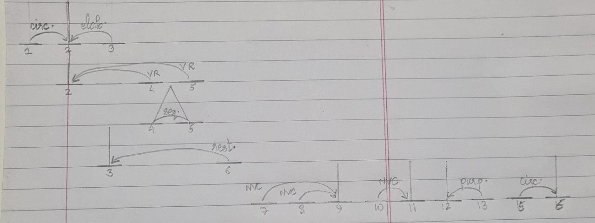
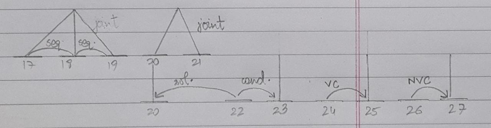
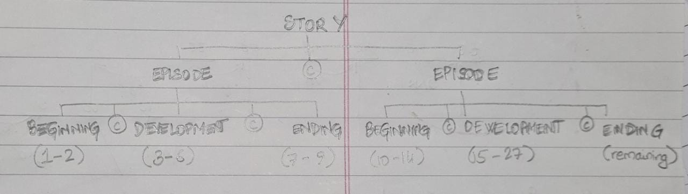

# Question 1
[ഒരു കുറുക്കൻ ഇരതേടി നടക്കുമ്പോൾ അവന്റെ വാൽ എങ്ങനെയോ ഒരു കെണിയൽ കുടുങ്ങി.  
കഷ്ടം! രക്ഷപ്പെടാൻ ഒരു മാർഗവുമില്ല. അവൻ കിടന്ന് പിടഞ്ഞു. തിരിഞ്ഞൂമറിഞ്ഞൂ. ഒരു രക്ഷയുമില്ല. അവസാനം ഊക്കോടെ ഒരു ചാട്ടം!  
ഹാവൂ! രക്ഷപ്പെട്ടു! പക്ഷെ, വാല് മുറിഞ്ഞുപോയി.  
മറ്റു കുറുക്കന്മാരോടെ വാൽ നോക്കി നമ്മുടെ വാലില്ലാക്കുറുക്കാൻ അസൂയപ്പെട്ടു.  
തന്റെ മാനം കാക്കാൻ മറ്റു കുറുക്കന്മാരുടെ വാലുകൾ കൂടി നഷ്ടപ്പെടുത്തിയേ മതിയാവൂ എന്ന് അവൻ തീരുമാനിച്ചു.  
ഒരു ദിവസം വാലില്ലാക്കുറുക്കൻ കാട്ടിലെ എല്ലാ കുറുക്കന്മാരുടെയും ഒരു യോഗം വിളിച്ചുകൂട്ടി. കുറുക്കന്മാരെല്ലാം എത്തിച്ചേർന്നു. വാലില്ലാകുറുക്കൻ പിൻതിരിഞ്ഞുനിന്ന് തന്റെ അറ്റുപോയ വാലിന്റെ കുറ്റി അവർക്ക് കാട്ടിക്കൊടുത്തുകൊണ്ട് പറഞ്ഞു:  
"സുഹൃത്തുകളേ, വാലുണ്ടായിരിക്കുക എന്നത് വലിയ ശല്യമാണ്. അതില്ലാത്താകുമ്പോഴാണ് വാലുള്ളതുകൊണ്ട് നമുക്കുണ്ടായിരുന്ന പല അസൗകര്യങ്ങളും മനസ്സിലാവുക. അതിനാൽ പ്രിയ സുഹൃത്തുകളേ, വരൂ നമുക്ക് വാൽ മുറിക്കുന്ന സ്ഥലത്തേക്ക് പോകാം. വാല് ഇന്ന് ഒരു പഴഞ്ചൻ ഫാഷനായി മാറിയിരിക്കുകയാണ്."  
മറ്റു കുറുക്കന്മാർ ഇതുകേട്ട് നിശബ്ദരായിരുന്ന് ചിന്തിച്ചു. അവരിൽ ചിലർ വാലില്ലാക്കുറുക്കൻ പറഞ്ഞത് ശരിയാണെന്ന് കരുതി തങ്ങളുടെയും വാൽ മുറിച്ചുകളയണമെന്ന് ആഗ്രഹിച്ചു.]{lang='ml'}  

## Part 1
The segments (units) of discourse, with transition, are as follows.  

| Serial No. | Segment | Translation |
| :---:      | :---    | :---        |
| 1 | [ഒരു കുറുക്കൻ ഇരതേടി നടക്കുമ്പോൾ,]{lang='ml'} | When a fox was wandering in search of prey, |
| | | |
| 2 | [അവന്റെ വാൽ എങ്ങനെയോ ഒരു കെണിയൽ കുടുങ്ങി.]{lang='ml'} | his tail somehow got stuck in a trap. |
| | | |
| 3 | [കഷ്ടം! രക്ഷപ്പെടാൻ ഒരു മാർഗവുമില്ല.]{lang='ml'} | Alas! There was no way to escape. |
| | | |
| 4 | [അവൻ കിടന്ന് പിടഞ്ഞു.]{lang='ml'} | He rolled around on the ground. |
| | | |
| 5 | [തിരിഞ്ഞൂമറിഞ്ഞൂ.]{lang='ml'} | He tossed and turned. |
| | | |
| 6 | [ഒരു രക്ഷയുമില്ല.]{lang='ml'} | There was no escape. |
| | | |
| 7 | [അവസാനം ഊക്കോടെ ഒരു ചാട്ടം!]{lang='ml'} | Finally, he jumped up forcefully! |
| | | |
| 8 | [ഹാവൂ! രക്ഷപ്പെട്ടു!]{lang='ml'} | Ah! He was safe! |
| | | |
| 9 | [പക്ഷെ, വാല് മുറിഞ്ഞുപോയി.]{lang='ml'} | But his tail was cut. |
| | | |
| 10 | [മറ്റു കുറുക്കന്മാരോടെ വാൽ നോക്കി നമ്മുടെ]{lang='ml'} | Seeing the tails of the other foxes, |
| | | |
| 11 | [വാലില്ലാക്കുറുക്കാൻ അസൂയപ്പെട്ടു.]{lang='ml'} | our tailless fox felt jealous. |
| | | |
| 12 | [തന്റെ മാനം കാക്കാൻ]{lang='ml'} | To keep his dignity, |
| | | |
| 13 | [മറ്റു കുറുക്കന്മാരുടെ വാലുകൾ കൂടി നഷ്ടപ്പെടുത്തിയേ മതിയാവൂ]{lang='ml'} | He had to make all the other foxes lose their tails, |
| | | |
| 14 | [എന്ന് അവൻ തീരുമാനിച്ചു.]{lang='ml'} | he decided. |
| | | |
| 15 | [ഒരു ദിവസം വാലില്ലാക്കുറുക്കൻ കാട്ടിലെ എല്ലാ കുറുക്കന്മാരുടെയും ഒരു യോഗം വിളിച്ചുകൂട്ടി.]{lang='ml'} | One day, the tailless fox called a meeting of all the foxes in the forest. |
| | | |
| 16 | [കുറുക്കന്മാരെല്ലാം എത്തിച്ചേർന്നു.]{lang='ml'} | All the foxes came together. |
| | | |
| 17 | [വാലില്ലാകുറുക്കൻ പിൻതിരിഞ്ഞുനിന്ന്]{lang='ml'} | The tailless fox turned around and stood, |
| | | |
| 18 | [തന്റെ അറ്റുപോയ വാലിന്റെ കുറ്റി അവർക്ക് കാട്ടിക്കൊടുത്തുകൊണ്ട്]{lang='ml'} | and, showing the stub of his tail to them, |
| | | |
| 19 | [പറഞ്ഞു:]{lang='ml'} | said: |
| | | |
| 20 | ["സുഹൃത്തുകളേ, വാലുണ്ടായിരിക്കുക എന്നാത് വലിയ ശല്യമാണ്.]{lang='ml'} | Friends, having a tail is a nuisance. |
| | | |
| 21 | [അതില്ലാത്താകുമ്പോഴാണ് വാലുള്ളതുകൊണ്ട് നമുക്കുണ്ടായിരുന്ന പല അസൗകര്യങ്ങളും മനസ്സിലാവുക.]{lang='ml'} | It is when it is not their that we realise the inconveniences that having it causes to us. |
| | | |
| 22 | [അതിനാൽ പ്രിയ സുഹൃത്തുകളേ, വരൂ നമുക്ക് വാൽ മുറിക്കുന്ന സ്ഥലത്തേക്ക് പോകാം.]{lang='ml'} | Hence, dear friends, come, let us go to the place to cut tails. |
| | | |
| 23 | [വാല് ഇന്ന് ഒരു പഴഞ്ചൻ ഫാഷനായി മാറിയിരിക്കുകയാണ്."]{lang='ml'} | The tail will today become an outdated fashion. |
| | | |
| 24 | [മറ്റു കുറുക്കന്മാർ ഇതുകേട്ട്]{lang='ml'} | The other foxes, hearing this, |
| | | |
| 25 | [നിശബ്ദരായിരുന്ന് ചിന്തിച്ചു.]{lang='ml'} | thought silently. |
| | | |
| 26 | [അവരിൽ ചിലർ വാലില്ലാക്കുറുക്കൻ പറഞ്ഞത് ശരിയാണെന്ന് കരുതി]{lang='ml'} | Some of them, thinking that what the tailless fox said was correct |
| | | |
| 27 | [തങ്ങളുടെയും വാൽ മുറിച്ചുകളയണമെന്ന് ആഗ്രഹിച്ചു.]{lang='ml'} | wished to cut their own tails. |

## Part 2
The discourse relations among the segments as divided above are as follows. (Note: $(i,j^N)$ means that $j$ is the nucleus and $i$ is the satellite in the relation.)

* $(1, 2^N)$: circumstance
* $(2^N, 3)$: elaboration
* $(2^N, 4)$: volitional result
* $(2^N, 5)$: volitional result
* $(4,5)$: sequence
* $(3^N, 6)$: restatement
* $(7,8^N)$: non-volitional cause
* $(7,9^N)$: non-volitional cause
* $(10,11^N)$: non-volitional cause
* $(12^N,13)$: purpose
* $(15,16^N)$: circumstance
* $(17,18,19)$: sequence
* $(20,21)$: joint
* $(20,22^N)$: solutionhood
* $(22^N,23)$: condition
* $(24,25^6)$: volitional cause
* $(26,27^N)$: non-volitional cause

## Part 3
The RST graph of the above story excerpt (split into two parts for convenience) can be seen in the figure. The legend for abbreviations is:

* **circ.** circumstance
* **elab.** elaboration
* **VR** volitional result
* **seq.** sequence
* **rest.** restatement
* **NVC** non-volitional cause
* **purp.** purpose
* **sol.** solutionhood
* **cond.** condition
* **VC** volitional cause

  



## Part 4
The complete version of the story goes on to say that an old fox stood up and said that the tailless fox lost his tail because he was in a trap, and they would do the same if necessary, but until then they would like to keep their tails.  

The story grammar tree structure (following Mandler (1984) as taught in class) for this story can be seen in the figure. The story has two main episodes. The first one starts with the fox's tail getting stuck and ends with him losing his tail. The second one starts with him feeling jealous and ends with the old fox opposing him.  

The segments (as marked above) are given with the parts of the story.



## Part 5
The discourse relations among the units of text show the main content that the writer intended to convey. The nuclei of the relations show the main parts of the text – they are the significant portions of the utterances. The satellites help to clarify or give more information regarding the nuclei. In effect, if we remove the nuclei, the text becomes almost meaningless, while if we remove the satellites, the text generally becomes summarised or contracted.  

Thus, the relations help us to show the coherence among parts of the text, and they give a structure to the linear spans of text. This is how discourse relations and discourse structures help in generating a coherent text.

# Question 2
The conversation I have chosen is from the TV show Brooklyn 99 and can be found [**here**](https://www.youtube.com/watch?v=0AW9mwZu7Vg).

## Part 1
```
T1 utt1  t: jake you gotta pick a napkin
T2 utt2  j: the binder said they should be beige
   utt3  j: i didn't realise there'd be 45 different shades
   utt4  j: chanterelle, desert whimsy, filbert husk
   utt5  j: words have no more meaning terry!
T3 utt6  t: we're running out of time, man
   utt7  t: you gotta make a call
T4 utt8  j: but what if i choose wrong?
   utt9  j: i mean that's a terrible way to start off a wedding
   utt10 j: people won't even watch our first dance
   utt11 j: they're gonna be too busy laughing at the napkins
T5 utt12 j: okay maybe i can narrow it down
   utt13 j: i think <sil> i don't like desert whimsy
T6 utt14 t: <sil> okay
T7 utt15 j: why did you pause like that before you said okay
   utt16 j: was that secretly your favourite one
T8 utt17 t: look you know amy better than anyone you just need to trust your gut
   utt18 t: what does your gut tell you
T9 utt19 j: that i'm a terrible napkin-chooser and will therefore be a horrible
            spouse
T10 utt20 t: that is not your gut that is your crazy nonsense brain
    utt21 t: trust me jake you know the right napkin
    utt22 t: is this the one
T11 utt23 j: shh with that crimping no way
    utt24 j: oh my god what did i just do
T12 utt25 t: you listened to your gut
T13 utt26 j: yes i have a gut my groom gut
T14 utt27 t: every groom has one you just have to find yours
T15 utt26 j: okay i can do this uhh
    utt27 j: this one's too big this one is scratchy this one is shedding
    utt28 j: this one is too rustic i am using that term right
T16 utt29 t: yes you're doing it it is too rustic
T17 utt30 j: this one <sil> classy very absorbent simple and it won't clash
             with our colour scheme
    utt31 j: it's perfect we'll take it
T18 utt32 t: groom guuuuut
T19 utt33 j: groom guuuuut

T20 utt34 j: okay so we are way behind
    utt35 j: picking up napkins took up a shockingly large part of the day
    utt36 j: which is funny because in my regular life i dont use napkins ever
T21 utt37 t: that's gross
    utt38 t: but the good news is your groom gut is all fired up
T22 utt39 j: she sure is and she's hungry for tasks
T23 utt40 t: your groom gut is a woman
T24 utt41 j: yeah why
T25 utt42 t: i think it's really cool
T26 utt43 j: oh thanks
    utt44 j: all right let's crush this list

T27 utt45 j: hey sarge look at this
    utt46 j: i cleared all my alarms we're amazing
    utt47 j: should we start a business where we just become professional
             choosers
    utt48 j: we should call it pro choice industries
T28 utt49 t: jake
T29 utt50 j: you're right that name is needlessly political
    utt51 j: but the business idea is solid
T30 utt52 t: no i'm not talking about that
    utt53 t: those decisions you made you are way over budget
T31 utt54 j: oh no <sil> my groom gut is a fancy bitch

T32 utt55 j: okay i have a plan to get us back on budget
    utt56 j: i got my groom gut to agree to a more basic wine package
T33 utt57 t: basic meaning simple or basic meaning basic
T34 utt58 j: basic meaning basic terry we're drinking the wine with the foot
             on the label
    utt59 j: but it's a huge savings and we can make up the rest if we just
             assemble the gift bags ourselves
T35 utt60 t: okay we can do that how much work can that possibly be
T36 utt61 j: here are amy's instructions
    utt62 j: place 8 jordan almonds two pink two blue two white two purple at
             the centre of the organza square
    utt63 j: draw the corners to a point and use the two-centimetre ribbon to
             cinch into a minibag
    utt64 j: good lord
T37 utt65 t: that doesn't sound so bad
T38 utt66 j: that's step 1 <sil> of 38
T39 utt67 t: we don't have time for that we need help we need to hire a team
T40 utt68 j: i know but there's no money in the budget
    utt69 j: maybe we can find people who are willing to work for something other
             than money
    utt70 j: hey hitchcock and scully how would you two like to earn some
             candy almonds
T41 utt71 h: you've got our attention

T42 utt72 j: wow we are actually gonna get these gift bags to the venue before
             they close
    utt73 j: thank you terry
T43 utt74 t: don't thank me hitchcock and scully did more than I did
T44 utt75 j: yeah but you had to hold your hand near their mouths when you fed
             them those almonds
T45 utt76 h: and that's scary were like snapping turtles
T46 utt77 j: exactly
    utt78 j: all right let's get going those chocolates are gonna melt
    utt79 j: oop open up
T47 utt80 t: i gave you the keys
T48 utt81 j: oh right where did i put them
    utt82 j: let's see i had them in my left hand
    utt83 j: and then i went to open the trunk so i switched to my right hand
    utt84 j: oh but then i had to sneeze and then i thought i don't wanna sneeze
             on these keys
    utt85 j: doctor seuss not really but should be
    utt86 j: do not sneeze on my keys do not wheeze on my keys
    utt87 j: do not sneeze on your knees on my keys if you [please](1)
T49 utt88 t: [jake](1) could you please move along with this thought journey
T50 utt89 j: yeah right sorry so then i put them on top of a plastic tub which
             is <sil> locked inside the car
    utt90 j: the keys are locked inside the car
T51 utt91 t: why
```

## Part 2
The turn-taking mechanism is very regular. Each of the characters (`t` and `j`) only starts speaking after the previous turn is complete, with one exception, *i.e.*, turn 48-49, where `t` saying `jake` overlaps with `j` saying `please`. This style of conversation is typical of TV shows and movies (and most other entertainment-oriented content online, where it is done for the convenience of the viewers), but real-life conversations may not always follow this pattern.

## Part 3
The following is the list of adjacency pairs in the above conversation.

| Pair of Turns | Type  |
| :---:         | :---: |
| (T7,T8)       | question/answer |
| (T8,T9)       | question/answer |
| (T10,T11)     | question/answer |
| (T11,T12)     | question/answer |
| (T15,T16)     | question/answer |
| (T23,T24)     | question/answer |
| (T24,T25)     | question/answer |
| (T25,T26)     | compliment/accept |
| (T33,T34)     | question/answer |
| (T35,T36)     | question/answer |
| (T40,T41)     | offer/accept    |
| (T49,T50)     | request/accept  |

## Part 4
The tags according to the DAMSL tagset are as follows. Each dimension has been tagged separately as instructed.

| Utterance | Comm.-Status | Info-Level | FL Function | BL Function |
| :---:     | :---: | :---: | :---: | :---: |
| `utt1`     | - | Task-Mgmt.| Assert, Action-Dir. | - |
| `utt2`     | - | Task-Mgmt.| Assert | - |
| `utt3`     | - | Task-Mgmt.| Assert | - |
| `utt4`     | - | Task-Mgmt.| Other-Stmt. | - |
| `utt5`     | - | Other-Level | Assert | - |
| `utt6`     | - | Task-Mgmt.| Assert | - |
| `utt7`     | - | Task-Mgmt.| Assert, Action-Dir. | - |
| `utt8`     | - | Other-Level | Info-Req. | Hold(`utt7`) |
| `utt9`     | - | Other-Level | Assert | - |
| `utt10`    | - | Other-Level | Assert | - |
| `utt11`    | - | Other-Level | Assert | - |
| `utt12`    | Self-Talk| Task| Other-Stmt. | - |
| `utt13`    | - | Task| Assert | - |
| `utt14`    | - | Task| Other-Stmt. | Ackn.(`utt13`) |
| `utt15`    | - | Comm.-Mgmt. | Info-Req. | - |
| `utt16`    | - | Task-Mgmt.| Info-Req. | - |
| `utt17`    | - | Task-Mgmt.| Assert, Action-Dir. | - |
| `utt18`    | - | Task-Mgmt.| Info-Req. | - |
| `utt19`    | - | Other-Level | Assert | Answer(`utt18`) |
| `utt20`    | - | Other-Level | Assert | Reject(`utt19`) |
| `utt21`    | - | Task-Mgmt.| Assert | - |
| `utt22`    | - | Task| Info-Req. | - |
| `utt23`    | - | Task| Assert | Answer(`utt22`) |
| `utt24`    | - | Other-Level | Info-Req. | - |
| `utt25`    | - | Other-Level | Assert | Answer(`utt24`) |
| `utt26`    | - | Task| Assert | Accept(`utt25`) |
| `utt27`    | - | Task| Assert | - |
| `utt28`    | - | Task| Info-Req. | - |
| `utt29`    | - | Task| Assert | Answer(`utt28`) |
| `utt30`    | - | Task| Assert | - |
| `utt31`    | - | Task| Assert, Commit | - |
| `utt32`    | - | Other-Level | Excl. | - |
| `utt33`    | - | Other-Level | Excl. | - |
| `utt34`    | - | Task-Mgmt.| Assert | - |
| `utt35`    | - | Task-Mgmt.| Assert | - |
| `utt36`    | - | Other-Level | Assert | - |
| `utt37`    | - | Other-Level | Assert | Ackn.(`utt36`) |
| `utt38`    | - | Other-Level | Assert | - |
| `utt39`    | - | Other-Level | Assert | Accept(`utt38`) |
| `utt40`    | - | Other-Level | Info-Req. | - |
| `utt41`    | - | Other-Level | Assert, Info-Req. | Answer(`utt40`) |
| `utt42`    | - | Other-Level | Assert | Answer(`utt41`) |
| `utt43`    | - | Other-Level | Expl. Perf. | Ackn.(`utt42`) |
| `utt44`    | - | Task-Mgmt.| Action-Dir., Commit | - |
| `utt45`    | - | Task-Mgmt.| Action-Dir. | - |
| `utt46`    | - | Task-Mgmt.| Assert | - |
| `utt47`    | - | Other-Level | Info-Req. | - |
| `utt48`    | - | Other-Level | Assert | - |
| `utt49`    | - | Comm.-Mgmt. | Other FF | - |
| `utt50`    | - | Other-Level | Assert | - |
| `utt51`    | - | Other-Level | Assert | - |
| `utt52`    | - | Comm.-Mgmt. | Assert | Hold(`utt51`) |
| `utt53`    | - | Task-Mgmt.| Assert | - |
| `utt54`    | - | Other-Level | Assert | Ackn.(`utt53`) |
| `utt55`    | - | Task-Mgmt.| Assert, Commit | - |
| `utt56`    | - | Task-Mgmt.| Assert | - |
| `utt57`    | - | Comm.-Mgmt. | Info-Req. | Signal N-U.(`utt56`) |
| `utt58`    | - | Comm.-Mgmt. | Assert | Answer(`utt55`) |
| `utt59`    | - | Task-Mgmt.| Assert | - |
| `utt60`    | - | Task-Mgmt.| Assert, Info-Req. | Accept(`utt59`) |
| `utt61`    | - | Task-Mgmt.| Assert | Answer(`utt60`) |
| `utt62`    | - | Task-Mgmt.| Action-Dir. | - |
| `utt63`    | - | Task-Mgmt.| Action-Dir. | - |
| `utt64`    | - | Other-Level | Excl. | - |
| `utt65`    | - | Task-Mgmt.| Assert | - |
| `utt66`    | - | Task-Mgmt.| Assert | Reject(`utt65`) |
| `utt67`    | - | Task-Mgmt.| Assert | - |
| `utt68`    | - | Task-Mgmt.| Assert | Accept-Part(`utt67`) |
| `utt69`    | - | Task-Mgmt.| Other-Op., Commit | - |
| `utt70`    | - | Task-Mgmt.| Excl. | - |
| `utt71`    | - | Task-Mgmt.| Assert | Hold(`utt70`) |
| `utt72`    | - | Task-Mgmt.| Assert | - |
| `utt73`    | - | Comm.-Mgmt. | Expl. Perf. | - |
| `utt74`    | - | Comm.-Mgmt. | Assert, Action-Dir. | Reject(`utt73`) |
| `utt75`    | - | Other-Level | Assert | Reject-P(`utt74`) |
| `utt76`    | - | Other-Level | Assert | Completion(`utt75`) |
| `utt77`    | - | Other-Level | Other-Stmt. | Accept(`utt76`) |
| `utt78`    | - | Task| Assert, Action-Dir. | - |
| `utt79`    | - | Task| Action-Dir. | - |
| `utt80`    | - | Task| Assert | - |
| `utt81`    | - | Other-Level | Info-Req. | - |
| `utt82`    | Self-Talk| Other-Level | Assert | Answer(`utt81`) |
| `utt83`    | Self-Talk| Other-Level | Assert | - |
| `utt84`    | Self-Talk| Other-Level | Assert | - |
| `utt85`    | Self-Talk| Other-Level | Other-Stmt. | - |
| `utt86`    | Self-Talk| Other-Level | Other-Stmt. | - |
| `utt87`    | Self-Talk| Other-Level | Other-Stmt. | - |
| `utt88`    | - | Comm.-Mgmt. | Action-Dir. | - |
| `utt89`    | Self-Talk| Other-Level | Assert | Accept(`utt89`)
| `utt90`    | - | Task| Assert | - |
| `utt91`    | - | Other-Level | Info-Req. | - |

# Question 3
NLU, or natural language understanding, is a problem that encompasses a wide range of situations. As the name suggests, it mainly consists of enabling a computational system to comprehend (and, in most cases, generate) linguistic matter.  
This is usually accomplished by creating a formal system in which the computer is able to record the meaning of the input. This formal representation can be manipulated to obtain a relevant and appropriate response, which can then be converted to textual output[^1].  

Natural language understanding systems can be either broad or deep. Depth is measured by the extent of the vocabulary and grammar of the system, and breadth by how close it is to a native speaker's speech. NLU systems have different applications depending on whether they are broad or deep; systems that are both broad and deep are beyond the current state of technology.[^2]  

NLU is an important module in several applications. Machine translation systems, dialogue systems, and document classification systems all use either a part or all of an NLU system to work. For example, a machine translation system would work by converting the input text into a language-neutral formal semantic representation, and then working to express the information content in the target language for output[^1]. Similarly, a dialogue system would take input, find its meaning, derive a pragmatically and semantically suitable response in a logical manner, and convert it to a text form for output. Document classification would proceed by analysing the semantic content of the documents to classify them according to their theme, tone, etc.  
In this way, NLU systems form an important component of many NLP applications.

[^1]: Bolshakov, Igor A., and Alexander Gelbukh. *Computational linguistics models, resources, applications.* Ciencia de la computación, 2004.
[^2]: https://en.wikipedia.org/wiki/Natural-language_understanding
